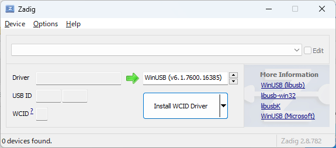
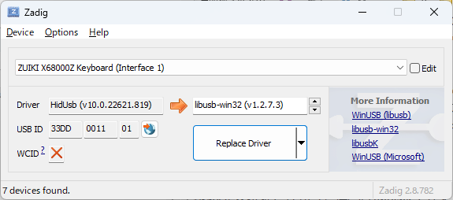
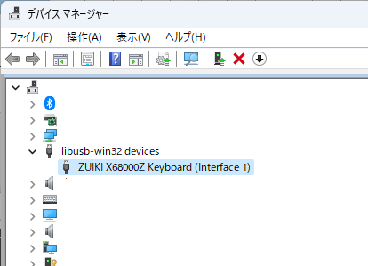

# pyUSB による X68000Z Keyboard LED 制御デモ

## 概要

[瑞起 X68000Z EARLY ACCESS KIT](https://www.zuiki.co.jp/x68000z/) に付属するキーボードのLEDを、Python の USB 制御ライブラリ [pyUSB](https://pyusb-docs.readthedocs.io/ja/latest/index.html) を用いて Windows や Linux 等から制御します。

Windows 11 と、Windows 11 上の WSL2 の Ubuntu-20.04 で動作を確認しています。

## 必要なもの

* 瑞起 X68000Z EARLY ACCESS KIT 付属キーボード
  * HACKER'S EDITION付属や単体売り版キーボードでも動くと思いますが未確認です

## Windows での手順

### ドライバのインストール

Windows から USB デバイスを pyUSB で制御するために、[Zadig](https://zadig.akeo.ie/) というツールを使って関連ドライバをインストールします。

1. X68000Z キーボードを PC に接続しておきます。
2. [Zadig](https://zadig.akeo.ie/) のサイトの Download 欄から最新の実行ファイルをダウンロードします(執筆時点での最新は zadig-2.8.exe)。
3. ダウンロードしたファイルを実行します。UACダイアログの後、以下のウィンドウが表示されます。
  
4. Options - List All Devices にチェックを入れることで、キーボードが認識されるようになります。
  
5. "ZUIKI X68000Z Keyboard" の **Interface 1** を選択し(Interface 0を選ばないように注意)、"libusb-win32" を "Install Driver" (または "Replace Driver") でインストールします。

### PythonとpyUSBのインストール

1. [Python 環境構築ガイド](https://www.python.jp/install/windows/index.html) に従って、Windows 版の Python をインストールします。
2. `pip install pyusb` で pyUSB をインストールします。

### 実行

[x68kzkbd.py](x68kzkbd.py) を Pythonから実行します。
```
python x68kzkbd.py
```

### アンインストール

* 誤って Interface 0 を選んでしまった場合など、デバイスと libusb の接続を解除したい場合には、Windows のデバイスマネージャの "libusb-win32 devices" から該当するデバイスを選択し、「デバイスのアンインストール」を「このデバイスのドライバを削除する」のチェックを入れて実行します。
  

## Linux (WSL2) での手順

### USB デバイス接続ツールのインストール

[USB デバイスを接続する](https://learn.microsoft.com/ja-jp/windows/wsl/connect-usb) の手順に従って、Windows PC に接続した USB デバイスを WSL2 環境から認識できるようにします。

1. Windows 環境に、[usbipd-win](https://github.com/dorssel/usbipd-win/releases) プロジェクトのページから最新版の usbipd-win をインストールします。
2. WSL2 環境の Linux 上から、以下のコマンドで Linux USB/IP ツールをインストールします。
    ```
    sudo apt install linux-tools-generic hwdata
    sudo update-alternatives --install /usr/local/bin/usbip usbip /usr/lib/linux-tools/*-generic/usbip 20
    ```

### PythonとpyUSBのインストール

WSL2 環境の Ubuntu に Python と pyUSB をインストールします。

```
sudo apt install python3
pip3 install pyusb
```

### USB デバイスの接続

1. X68000Z キーボードを PC に接続しておきます。
2. Windows の PowerShell またはコマンドプロンプトを管理者権限で開いて以下のコマンドを実行します。
    ```
    usbipd wsl list
    ```
3. X68000Z キーボードの VID:PID は `33dd:0011` です。表示される USB デバイスのリストからこの VID:PID を探して、対応する BUSID を指定して `usbipd wsl attach` コマンドを実行します。
    ```
    >usbipd wsl list
    BUSID  VID:PID    DEVICE                                                        STATE
    1-3    33dd:0011  USB 入力デバイス                                              Not attached
    ```
    この場合の BUSID は 1-3 なので、以下のコマンドを実行します。
    ```
    usbipd wsl attach --busid 1-3
    ```
4. X68000Z キーボードの Windows からの認識が解除され、WSL2 環境に接続されます。`dmesg` で以下のようなログが出ていれば OK です。
    ```
    [183046.600156] usb 1-1: New USB device found, idVendor=33dd, idProduct=0011, bcdDevice=60.16
    [183046.600722] usb 1-1: New USB device strings: Mfr=1, Product=2, SerialNumber=0
    [183046.601201] usb 1-1: Product: ZUIKI X68000Z Keyboard
    [183046.601534] usb 1-1: Manufacturer:
    [183046.605078] input:   ZUIKI X68000Z Keyboard as /devices/platform/vhci_hcd.0/usb1/1-1/1-1:1.0/0003:33DD:0011.000B/input/input20
    [183046.675777] hid-generic 0003:33DD:0011.000B: input: USB HID v1.11 Keyboard [  ZUIKI X68000Z Keyboard] on usb-vhci_hcd.0-1/input0
    [183046.678927] input:   ZUIKI X68000Z Keyboard System Control as /devices/platform/vhci_hcd.0/usb1/1-1/1-1:1.1/0003:33DD:0011.000C/input/input21
    [183046.745777] input:   ZUIKI X68000Z Keyboard Consumer Control as /devices/platform/vhci_hcd.0/usb1/1-1/1-1:1.1/0003:33DD:0011.000C/input/input22
    [183046.746957] input:   ZUIKI X68000Z Keyboard as /devices/platform/vhci_hcd.0/usb1/1-1/1-1:1.1/0003:33DD:0011.000C/input/input23
    [183046.747677] hid-generic 0003:33DD:0011.000C: input: USB HID v1.11 Keyboard [  ZUIKI X68000Z Keyboard] on usb-vhci_hcd.0-1/input1
    ```
5. デフォルトでは USB デバイスは root からしか扱えないパーミッションになっているので、これを変更します。通常は udev サービスがこれを行ってくれるのですが、WSL2 環境では udev が動いていないので手動で変更します。
    ```
    lsusb
    ```
    これを実行して、X68000Z キーボードのデバイスノードを確認します。
   ```
   Bus 001 Device 007: ID 33dd:0011   ZUIKI X68000Z Keyboard
   ```
   こうなっていた場合、キーボードデバイスは　`/dev/bus/usb/001/007` です。一般ユーザがこのデバイスを操作できるようにします。
   ```
   sudo chmod a+rw /dev/bus/usb/001/007
   ```

### 実行

[x68kzkbd.py](x68kzkbd.py) を Pythonから実行します。
```
python3 x68kzkbd.py
```

## X68000Z キーボードのLED制御について

(筆者の独自解析によるため、内容の正確性は保証しません）

* X68000Z のキーボードは1つのコンフィグレーションに対して2つのインターフェースディスクリプタを持っています。
* インターフェース0は通常のUSBキーボードと同じですが、インターフェース1は複数のHIDレポートIDを持ち(1, 2, 5, 6, 10)、そのうちID 10のFeatureレポートに対してHIDクラスリクエストのSET_REPORTを実行することで、LEDの制御ができるようです。
* SET_REPORTでは必ず65バイト (ID 1バイト + データ本体64バイト)のデータを送り、その中の値でLEDの状態を設定します。
  * data[0] = 0x0a (10) .... レポートID
  * data[1] = 0xf8      .... (LED設定コマンド？)
  * data[7] = かな LEDの明るさ (0x00～0xffで値が大きいほど明るい)
  * data[8] = ローマ字 LED
  * data[9] = コード入力 LED
  * data[10] = CAPS LED
  * data[11] = INS LED
  * data[12] = (未使用)
  * data[13] = ひらがな LED
  * data[14] = 全角 LED
  * 他のデータの値は 0x00 にしておきます

## ライセンス

本プログラムはMITライセンスとします。
